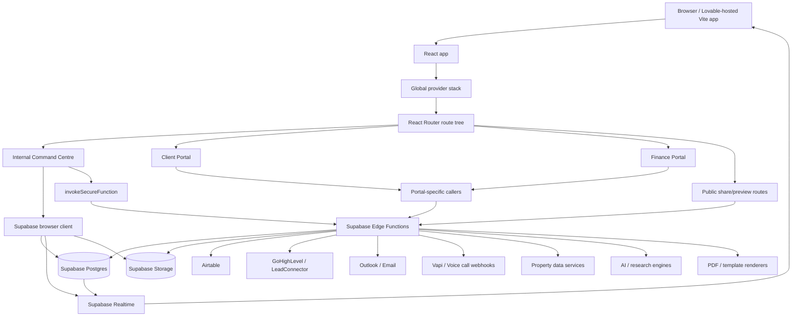
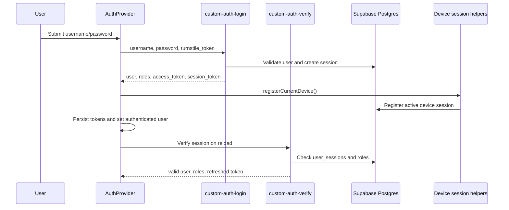
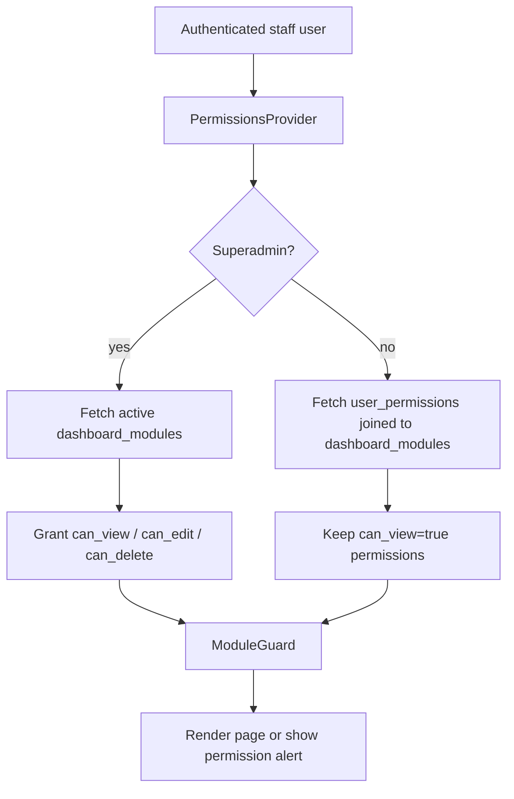
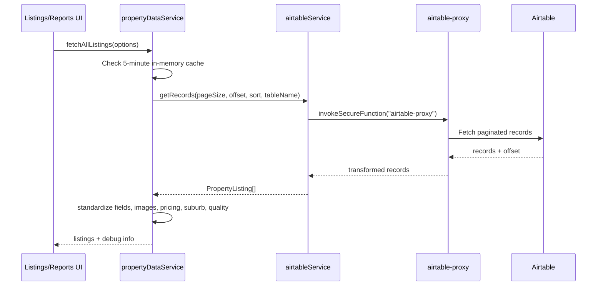
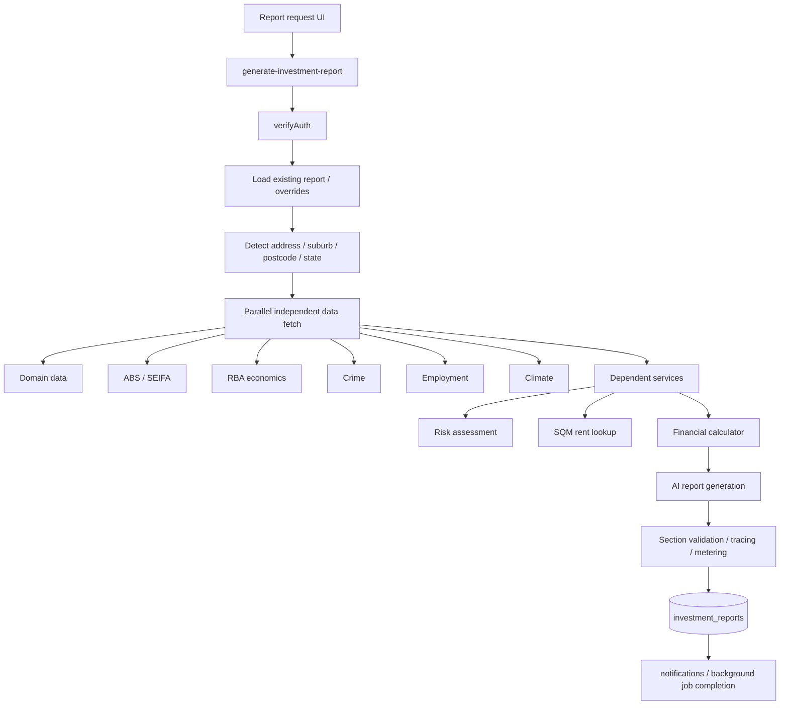
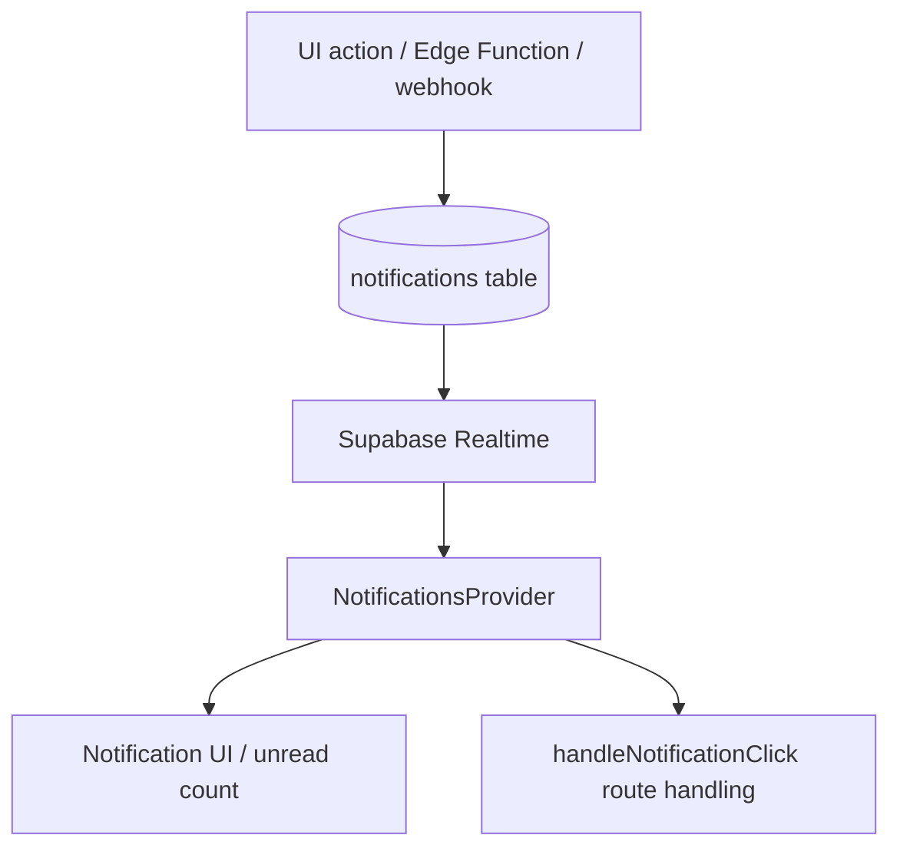

# NPC Command Centre — Architectural Flow

_Last updated: 2026-07-08_

## 1. Purpose

This document explains the end-to-end architecture of the NPC Command Centre codebase. It is written for developers, AI agents, maintainers, and operators who need to understand how the application boots, how the main route surfaces are separated, how authentication and permissions work, how the frontend communicates with Supabase Edge Functions, and how major workflows such as property data, reports, notifications, portals, GHL conversations, and template/PDF rendering fit together.

The system is a multi-surface operating platform, not a simple dashboard. It includes:

- an internal Command Centre for staff and administrators;
- a client-facing portal;
- a finance partner portal;
- public share/preview routes;
- Supabase Postgres, Realtime, Storage, and Edge Functions;
- integrations for Airtable, GoHighLevel/LeadConnector, Outlook/email, Vapi/call events, property data services, report generation, and PDF/template rendering.

## 2. Primary code anchors

| Area | Main files |
| --- | --- |
| App boot | `src/main.tsx`, `src/App.tsx` |
| Internal dashboard shell | `src/components/layout/DashboardLayout.tsx` |
| Supabase browser client | `src/integrations/supabase/client.ts` |
| Internal auth | `src/hooks/useAuth.tsx`, `src/components/auth/ProtectedRoute.tsx` |
| Module permissions | `src/hooks/usePermissions.tsx`, `src/components/auth/ModuleGuard.tsx` |
| Secure Edge Function caller | `src/lib/secureInvoke.ts` |
| Shared backend auth | `supabase/functions/_shared/auth.ts` |
| Backend function registry | `supabase/config.toml` |
| Airtable/property data | `src/lib/airtable.ts`, `src/services/propertyDataService.ts` |
| Reports | `src/pages/Reports.tsx`, `src/hooks/useReportGenerator.tsx`, `supabase/functions/generate-investment-report/index.ts` |
| Notifications/background jobs | `src/contexts/NotificationsContext.tsx`, `src/components/BackgroundJobTracker.tsx` |
| GHL conversations | `src/pages/Conversations.tsx`, `supabase/functions/sync-ghl-conversations/index.ts`, `supabase/functions/send-ghl-message/index.ts` |
| Client portal auth | `src/hooks/usePortalAuth.tsx` |
| Finance portal auth | `src/hooks/useFinancePortalAuth.tsx` |

## 3. High-level architecture



## 4. Runtime boot flow

1. `src/main.tsx` imports the React root, `App`, and global CSS.
2. The entrypoint performs service-worker hygiene:
   - old service workers are unregistered;
   - the dedicated push worker at `/sw-push.js` is preserved;
   - stale browser caches are cleared.
3. `App` mounts the global provider stack.
4. `PathNormalizer` normalizes duplicate slashes in URLs.
5. Global background/listener components mount once near the route tree:
   - `BackgroundJobTracker`
   - `ReportGenerationProgress`
   - `CallNotificationListener`
   - `Phase1NotificationListeners`
   - `TokenEventsListener`
   - `PushNotificationPrompt`
6. React Router dispatches into one of four surfaces:
   - public routes;
   - client portal;
   - finance portal;
   - internal Command Centre.

## 5. Provider hierarchy

```text
QueryClientProvider
└── TooltipProvider
    └── BrandProvider
        └── AuthProvider
            └── PermissionsProvider
                └── BrowserRouter
                    └── NotificationsProvider
                        └── ComparisonProvider
                            └── SearchProvider
                                └── Routes
```

Architectural implications:

- `AuthProvider` must resolve the staff user before module permissions can be trusted.
- `PermissionsProvider` depends on `useAuth`.
- `NotificationsProvider` depends on the authenticated user ID for targeted notification filtering.
- Query, brand, search, comparison, toast, and tooltip context are globally available to all route surfaces.

## 6. Route surface architecture

### 6.1 Public routes

Public routes are intentionally not wrapped by the internal `ProtectedRoute`:

- `/qa/shared/:token`
- `/qa/market/:slug`
- `/template-share/:token`

These routes support shareable answers and template previews without requiring a staff session.

### 6.2 Internal Command Centre

The internal dashboard is mounted under `/` and protected by `ProtectedRoute`.

```text
ProtectedRoute
└── HarveyCountdown
└── DashboardLayout
    ├── desktop: DashboardSidebar + DashboardHeader
    ├── mobile/tablet: MobileHeader + MobileNav
    ├── DashboardPageShell
    ├── TokenBalanceBanner
    ├── Outlet
    └── AgentChatWidget
```

Most internal pages are wrapped by `ModuleGuard`, for example:

```text
/reports                  -> ModuleGuard("reports")
/generated-reports        -> ModuleGuard("generated_reports")
/data-import              -> ModuleGuard("data_import")
/automation               -> ModuleGuard("automation")
/email-copilot            -> ModuleGuard("email_copilot")
/call-logs                -> ModuleGuard("call_logs")
/report-qa                -> ModuleGuard("report_qa")
/admin/users              -> ModuleGuard("user_management")
/admin/template-builder   -> ModuleGuard("templates")
/admin/pdf-import-engine  -> ModuleGuard("templates")
```

### 6.3 Client portal

The client portal has a separate auth/session surface and is mounted under `/client`.

```text
PortalAuthProvider
└── PortalProtectedRoute
    └── PortalLayout
        └── dashboard / profile / properties / reports / documents / messages / booking / appointments
```

The client portal uses `portal_session_token`, not the internal staff `session_token`.

### 6.4 Finance portal

The finance portal is mounted under `/finance/*` and uses its own finance session layer.

```text
FinancePortalAuthProvider
└── FinancePortalProtectedRoute
    └── FinancePortalLayout
        └── dashboard / purchase files / clients / messages / pipeline / reports / settings
```

The finance portal uses `finance_portal_session_token`. It also includes a short post-login grace window and re-verification on some 401 responses to prevent transient background-widget failures from prematurely logging users out.

## 7. Authentication architecture

### 7.1 Internal staff auth

The internal Command Centre uses custom staff authentication backed by Supabase Edge Functions and database session rows.



Browser-side staff storage keys:

- `supabase_access_token`
- `session_token`
- `current_user`
- `auth_version`

Notable behaviours:

- stale tokens are purged when the auth version changes;
- sessions are verified on app mount;
- device registration happens before protected dashboard access is finalized;
- active devices heartbeat every five minutes;
- sign-out releases the device slot, calls `custom-auth-logout`, logs activity, and clears browser state.

### 7.2 Secure Edge Function invocation

Most privileged calls go through `invokeSecureFunction`.

`invokeSecureFunction` sends:

- `Authorization: Bearer <access token or anon key>`;
- Supabase anon `apikey`;
- `x-session-token` when available;
- `session_token` in the JSON body;
- `command_centre_session_token` for Command Centre messaging functions.

It also handles:

- request timeout control;
- one-shot token refresh through `custom-auth-verify`;
- global auth-failure circuit breaking after repeated failures;
- special body-token-only handling for selected template/PDF functions where custom headers would trigger failing CORS preflights;
- token usage event emission for metered report-generation functions;
- insufficient-funds events for Mission Control billing.

### 7.3 Shared backend auth

Backend auth is centralized in `supabase/functions/_shared/auth.ts`.

The validation order is:

1. service-role bearer token for internal service-to-service calls;
2. authenticated Supabase JWT mapped to `custom_users`;
3. custom session token extracted from cookies, `x-command-centre-session-token`, `x-session-token`, body, or a non-JWT bearer token.

Several functions are configured with `verify_jwt=false` and then verify auth inside the function. This is intentional where custom sessions, service-role callbacks, webhooks, portal tokens, or chunked render callbacks must reach the function before auth is evaluated.

## 8. Authorization and module permissions

After staff authentication resolves, `PermissionsProvider` loads module authorization.



Rules:

- superadmins can access every active module;
- non-superadmins depend on `user_permissions` rows;
- `ModuleGuard` supports view, edit, and delete gates.

## 9. Data access architecture

The frontend uses two primary data-access patterns.

### 9.1 Direct Supabase browser client

The typed Supabase client is used for browser-safe table, realtime, and storage operations.

Common examples:

- notification reads/writes;
- notification realtime subscription;
- permissions table reads;
- chart configuration reads;
- GHL conversation realtime refreshes;
- selected portal/client reads where policies or function wrappers allow it.

### 9.2 Edge Functions through `invokeSecureFunction`

Server-side, privileged, third-party, or heavy operations go through Edge Functions.

| Frontend operation | Edge Function path |
| --- | --- |
| Airtable property listing reads | `airtable-proxy` |
| Generated report retrieval | `get-investment-reports` |
| Report mutation/status | `manage-investment-reports` |
| Investment report generation | `generate-investment-report` |
| Client data operations | `get-client-data`, `manage-client-data` |
| GHL sync and sending | `sync-ghl-conversations`, `send-ghl-message` |
| Email replies | `send-email-reply` |
| Template/PDF import and render | `template-import-pdf`, `template-design-agent`, `render-source`, `render-template-pdf`, `pdf-parse-dispatch` |
| Billing and token usage | `mission-control-*` functions |

## 10. Backend function groups

`supabase/config.toml` is the backend registry. It defines project configuration, local development ports, auth settings, Edge Function JWT policy, and request timeouts.

| Group | Example functions | Purpose |
| --- | --- | --- |
| Custom auth | `custom-auth-login`, `custom-auth-verify`, `custom-auth-logout` | Staff session lifecycle |
| Property/report generation | `generate-investment-report`, `render-investment-report-pdf`, `get-investment-reports`, `manage-investment-reports` | Investment report lifecycle |
| Data services | `abs-data-service`, `rba-data-service`, `domain-data-service`, `financial-calculator-service`, `risk-assessment-service`, `sqm-rent-service` | Research and modelling data |
| Automation/import | `auto-report-webhook`, `auto-report-sync`, `manage-data-import`, `airtable-proxy` | Data ingestion and automation |
| PDF/template engine | `template-import-pdf`, `template-design-agent`, `render-source`, `render-template-pdf`, `pdf-parse-dispatch`, `pdf-parse-callback` | Template builder and rendering |
| GHL/client operations | `sync-client-to-ghl`, `sync-ghl-pipelines`, `update-ghl-opportunity-stage`, `ghl-webhook-receiver`, `sync-ghl-conversations`, `send-ghl-message` | CRM and communications sync |
| Email/Outlook | `email-copilot`, `outlook-email-sync`, `outlook-email-webhook`, `send-email-reply` | Email assistant and mailbox sync |
| Calls/Vapi | `vapi-call-webhook`, `voice-to-text`, `get-call-logs`, `manage-call-logs` | Call log and voice workflows |
| Client portal | `client-portal-*`, `get-portal-client-data`, `manage-portal-client-data`, `client-portal-comms` | Client-facing portal |
| Finance portal | `finance-portal-*`, `finance-portal-messages`, `finance-portal-documents`, `finance-portal-purchase-files` | Finance partner portal |
| Billing/mission control | `mission-control-*`, `message-governance`, `manage-commission-ledger` | Usage, balances, governance, commercial workflows |
| Notifications/push | `push-subscribe`, `push-unsubscribe`, `send-web-push`, `get-vapid-public-key` | Browser push notifications |

## 11. Property data and Airtable flow



Key design points:

- the browser never calls Airtable directly;
- `propertyDataService` is the normalization/cache layer shared by dashboard and report modules;
- Airtable fields are mapped into `PropertyListing` while `rawFields` is preserved for table-specific views;
- data quality and completeness scores are computed after fetch.

## 12. Report generation architecture

The system has two major report paths.

### 12.1 Quantitative dashboard PDF path

The `Reports` page fetches normalized property listings, calculates KPIs and chart datasets, optionally requests generated chart images through `generate-charts-python`, and creates a PDF in-browser with `jsPDF` and `html2canvas`.

### 12.2 Investment report backend path

`generate-investment-report` is the heavier backend report engine.



Important behaviours:

- existing database overrides are merged with frontend overrides;
- effective values such as price, rent, LVR, interest rate, build type, land size, and zoning are resolved once and reused consistently;
- report scope and generation engine are restored from the existing DB row during retries/continuations;
- service-to-service calls use the Supabase service-role key;
- independent data services are fetched in parallel;
- dependent services run after the first data pass;
- circuit breakers and timeout wrappers reduce cascading failures;
- report status is updated in `investment_reports`.

## 13. Notification and background job architecture

Notifications are persisted in the `notifications` table and loaded through `NotificationsProvider`.



`BackgroundJobTracker` handles client-side tracking of long-running jobs by:

- loading job IDs from `localStorage`;
- polling every three seconds while jobs exist;
- checking job-specific status through Edge Functions;
- cleaning up completed or failed jobs;
- relying on server-created notifications where available to avoid duplicate notifications.

Tracked job types:

- `bulk_generation`
- `comparison_analysis`
- `investment_report`

## 14. GHL and conversation architecture

GHL conversations are mirrored into Supabase tables:

- `ghl_conversations`
- `ghl_conversation_messages`

The Conversations page:

1. reads local conversations through `get-client-data`;
2. fetches selected conversation messages through `get-client-data`;
3. subscribes to realtime changes on both conversation tables;
4. can trigger incremental sync through `sync-ghl-conversations`;
5. sends outbound GHL messages through `send-ghl-message`;
6. sends outbound email replies through `send-email-reply`.

Outbound GHL messages are sent to LeadConnector and then upserted back into Supabase so the local UI remains consistent.

## 15. Template and PDF architecture

Template/PDF workflows are organized around Edge Functions such as:

- `template-import-pdf`
- `template-design-agent`
- `render-source`
- `render-template-pdf`
- `figma-template-sync`
- `pdf-import-diagnostics`
- `pdf-parse-dispatch`
- `pdf-parse-callback`
- `pdf-parse-chunk-callback`

Important rule: gateway JWT verification is intentionally disabled for several of these functions because the functions perform their own auth checks and/or must accept service callbacks from parsing/rendering sidecars.

## 16. Billing and token architecture

Billing and token usage are handled through Mission Control functions and frontend token events.

Key frontend pieces:

- `TokenEventsListener`
- `TokenBalanceBanner`
- token usage emission inside `invokeSecureFunction`

Key backend groups:

- `mission-control-webhook`
- `mission-control-balance`
- `mission-control-packs`
- `mission-control-seats`
- `mission-control-devices`
- `mission-control-catalog`
- `mission-control-key-info`
- `mission-control-rotate-key`

Report-generation functions can return usage headers/body fields. The frontend converts these into UI events so users can see metered activity and out-of-token states.

## 17. Operational extension rules

When adding new architecture:

1. Add frontend pages under the appropriate surface: internal, client portal, finance portal, or public.
2. Wrap internal modules with `ModuleGuard` and add matching module/permission rows.
3. Use direct Supabase browser calls only for browser-safe operations.
4. Use Edge Functions for secrets, third-party APIs, service-role reads/writes, heavy jobs, and webhooks.
5. Reuse `invokeSecureFunction` for internal staff calls unless the surface is a portal-specific flow.
6. Reuse shared auth helpers in Edge Functions rather than writing ad-hoc token parsing.
7. Document any `verify_jwt=false` function with a comment in `supabase/config.toml` explaining why gateway JWT verification must remain disabled.
8. For long-running jobs, persist status in Supabase and either use realtime notifications or client-side background polling.
9. For external integrations, store credentials in Supabase secrets or `integration_secrets`, never in frontend code.
10. Update this document and `docs/COMMUNICATION_FLOW.md` whenever a new system boundary or integration path is added.

## 18. Quick mental model

```text
React route surface
  -> auth provider for that surface
  -> permission/session guard
  -> page/component
  -> direct Supabase read OR secure Edge Function call
  -> Supabase database/storage OR external integration
  -> persisted result/status/notification
  -> realtime or polling updates back to the UI
```

This is the backbone of the NPC Command Centre architecture.
