# NPC Command Centre — Communication Flow

_Last updated: 2026-07-08_

## 1. Purpose

This document explains the end-to-end communication flow of the NPC Command Centre codebase. It focuses on how requests, responses, tokens, realtime events, webhooks, external integrations, and background job status updates move through the system.

Use this document when debugging:

- login/session problems;
- Supabase Edge Function CORS/auth failures;
- stale or missing notifications;
- GHL conversation sync issues;
- outbound SMS/WhatsApp/email sending;
- client portal or finance portal session issues;
- report-generation progress and completion;
- webhook ingestion from GHL, Outlook, Vapi, or external automation systems.

## 2. Communication map

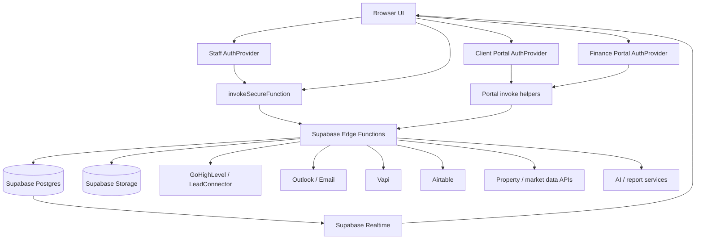

## 3. Main communication channels

| Channel | Direction | Used for |
| --- | --- | --- |
| Browser -> Supabase browser client | direct | safe table reads/writes, realtime subscriptions, selected storage operations |
| Browser -> `invokeSecureFunction` -> Edge Function | request/response | staff dashboard backend operations, third-party API calls, privileged DB operations |
| Browser -> portal invoke helpers -> Edge Function | request/response | client portal and finance portal operations |
| Edge Function -> Supabase Postgres | server-side | service-role reads/writes, status updates, webhooks, logs |
| Edge Function -> third-party API | server-side | GHL, Outlook, Airtable, property data services, AI engines |
| Third-party webhook -> Edge Function | inbound webhook | GHL events, Vapi calls, Outlook email/calendar webhooks, automation callbacks |
| Supabase Postgres -> Realtime -> Browser | event stream | notifications, conversations, message updates |
| Browser -> localStorage/sessionStorage | local state | session tokens, background job IDs, processed job IDs, UI handoff state |

## 4. Staff Command Centre request flow

Most staff dashboard operations follow this path:

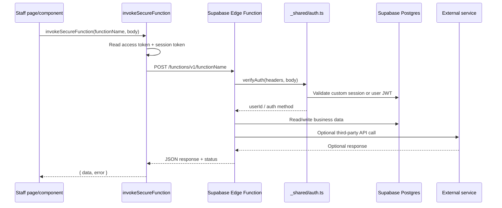

`invokeSecureFunction` is the default communication gateway for internal staff calls. It centralizes:

- token selection;
- session-token fallback;
- body token injection;
- Command Centre messaging token aliases;
- request timeout handling;
- one-shot token refresh;
- repeated-auth-failure circuit breaking;
- report token usage event emission;
- insufficient-funds event emission.

## 5. Staff authentication flow

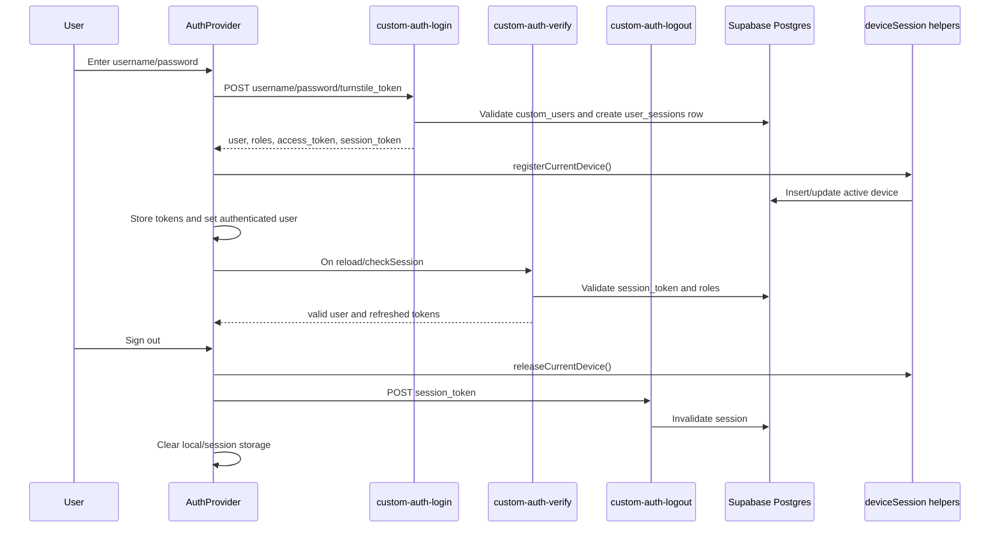

Staff browser storage keys:

```text
supabase_access_token
session_token
current_user
auth_version
```

Important auth behaviour:

- `custom-auth-verify` is used both for initial session verification and token refresh.
- If a staff session reaches device limits, the app keeps pending tokens only long enough for the user to revoke another device or cancel sign-in.
- Device heartbeat runs every five minutes while the user is signed in.

## 6. Auth token transport rules

### 6.1 Internal staff calls

Internal staff calls may carry the same session through multiple locations for resilience:

```text
Authorization: Bearer <access token or anon key>
apikey: <Supabase anon key>
x-session-token: <session_token>
x-command-centre-session-token: <session_token>   // selected messaging functions only

JSON body:
{
  ...payload,
  "session_token": "<session_token>",
  "command_centre_session_token": "<session_token>" // selected messaging functions only
}
```

### 6.2 Backend token extraction order

The shared auth helper extracts the session token in this order:

1. cookie `session_token`;
2. `x-command-centre-session-token` header;
3. `x-session-token` header;
4. `command_centre_session_token` body field;
5. `session_token` body field;
6. non-JWT bearer token.

Before session fallback, the backend also accepts:

- direct service-role bearer matches;
- service-role JWT role;
- authenticated Supabase JWTs that map to `custom_users`.

### 6.3 Body-token-only functions

Some template/PDF functions intentionally receive session tokens in the body only, because custom headers can trigger CORS preflight failures on older function deployments.

Current body-token-only function names in `secureInvoke`:

```text
template-import-pdf
template-design-agent
render-source
import-from-url
pdf-parse-dispatch
```

## 7. Client portal communication flow

Client portal calls use a separate session token and separate invoke helper.

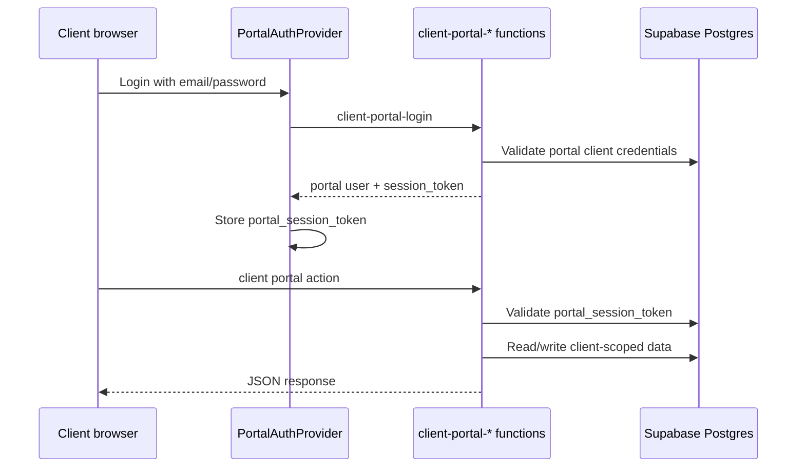

Client portal token transport:

```text
Browser key: portal_session_token
Header: x-portal-session-token
Body: portal_session_token, session_token
Authorization: Bearer <anon key>
```

Typical functions:

- `client-portal-login`
- `client-portal-verify`
- `client-portal-logout`
- `client-portal-forgot-password`
- `client-portal-reset-password`
- `client-portal-invite`
- `client-portal-accept-invite`
- `get-portal-client-data`
- `manage-portal-client-data`
- `client-portal-comms`

## 8. Finance portal communication flow

Finance portal calls also use their own session token and invocation helper.

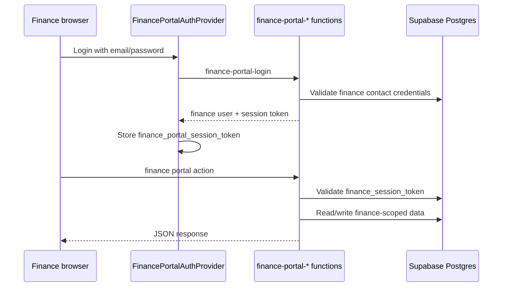

Finance portal token transport:

```text
Browser key: finance_portal_session_token
Header: x-finance-session-token
Body: finance_session_token, session_token
Authorization: Bearer <anon key>
```

The finance invoke helper has a protective re-verify flow:

1. if a non-login function returns a 401 with invalid/expired session wording;
2. and the user was not very recently authenticated;
3. the helper calls `finance-portal-verify`;
4. only if verification fails does it clear the session and redirect to `/finance/login`.

This avoids logging users out because of a single transient widget or race-condition failure.

## 9. Realtime communication flow

Realtime is used for UI freshness without manually polling every table.

### 9.1 Notifications

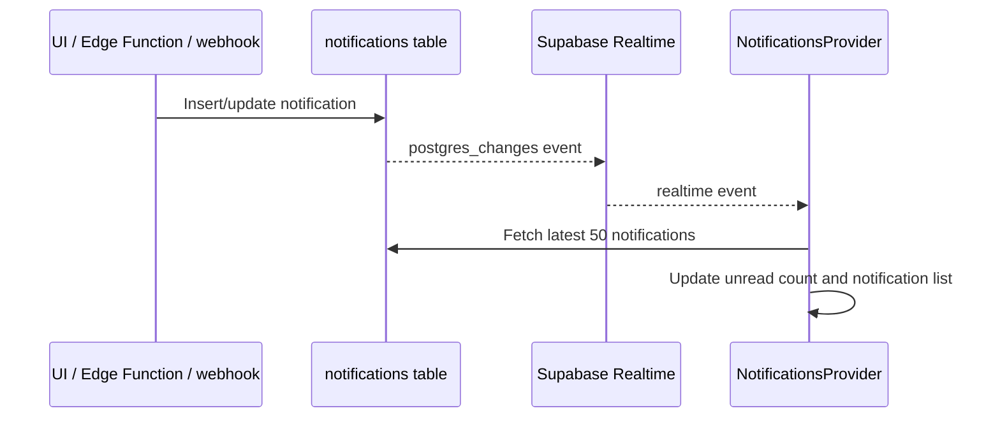

Notification routing is centralized in `handleNotificationClick`. Notification type controls the destination, for example:

- report notifications -> `/generated-reports?tab=investment`
- call notifications -> `/call-logs`
- appointment notifications -> `/calendar`
- client/deal/reminder notifications -> `/clients`, `/deal-pipeline`, or `/reminders`
- portal messages -> client profile tabs
- finance portal messages -> client finance message tabs
- GHL conversation replies -> `/conversations`

### 9.2 GHL conversations

The Conversations page subscribes to:

- `ghl_conversations` changes;
- inserted `ghl_conversation_messages` rows.

When matching changes arrive, the page invalidates/refetches relevant React Query caches.

## 10. Background job communication flow

Long-running work is represented by persisted status plus client-side polling.

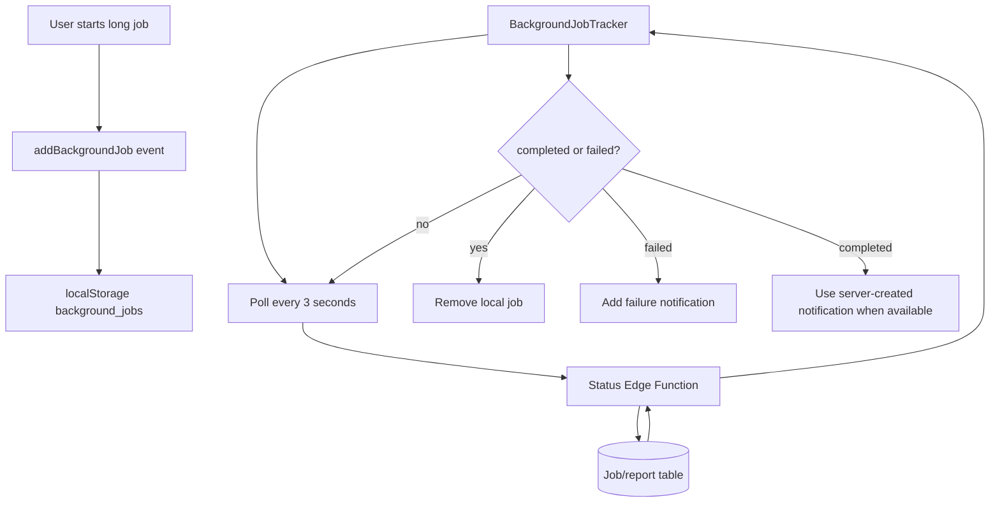

Tracked job types:

```text
bulk_generation
comparison_analysis
investment_report
```

Status check routes:

- bulk generation: `manage-templates` with `bulk_generation_jobs` table;
- comparison analysis: `get-investment-reports` with `property_comparisons` table;
- investment report: `get-investment-reports` selecting `id, property_address, status, error_message`.

## 11. Airtable/property listing communication flow

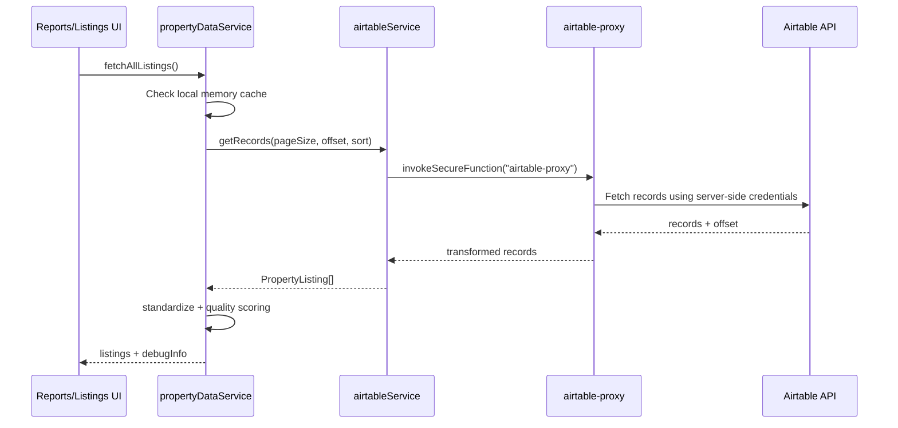

The browser does not contact Airtable directly. This protects Airtable credentials and keeps record transformation centralized.

## 12. Investment report communication flow

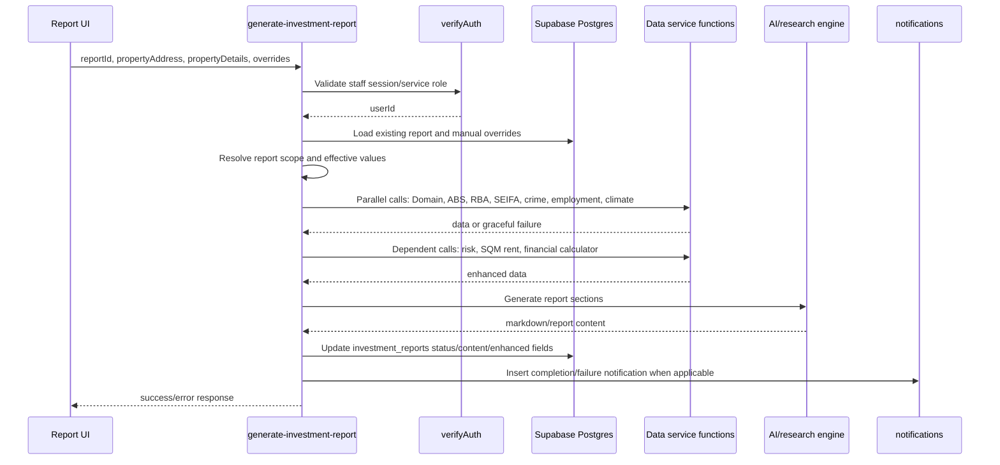

Important communication rules:

- service-to-service data calls use the Supabase service-role bearer token;
- independent data services are fetched in parallel;
- dependent services run after initial data is available;
- failures in non-critical data services should degrade gracefully rather than failing the entire report;
- report rows must reflect status accurately: `processing`, `completed`, or `failed`;
- failures should store `error_message` for UI and operational diagnosis.

## 13. GHL conversation sync flow

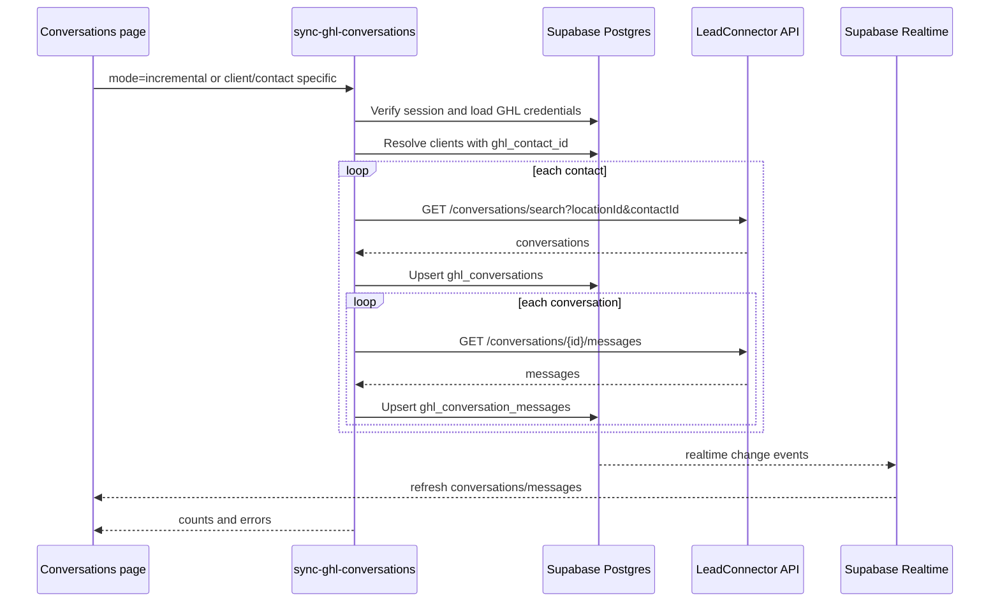

Key implementation details:

- credentials are resolved through `getEffectiveGhlCredentials`;
- contacts can be synced by `client_id`, `ghl_contact_id`, or bulk mode;
- rate limits are respected with delays between contacts/pages;
- conversations and messages are upserted, not blindly inserted;
- message dates and channels are normalized before persistence.

## 14. Outbound GHL message flow

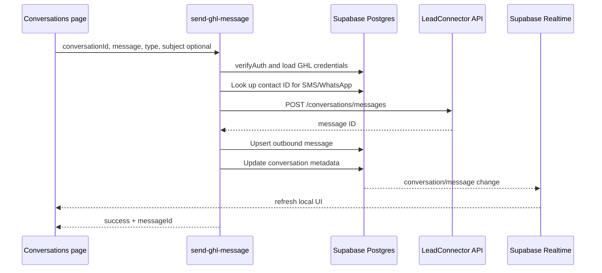

Channel handling:

- SMS/WhatsApp-style messages use `message` and may require `contactId`;
- email-style messages use `html`, `message`, and optional `subject`;
- outbound messages are persisted locally after GHL accepts them.

## 15. Email reply flow

The Conversations page can send email replies through `send-email-reply` when the selected reply channel is email.

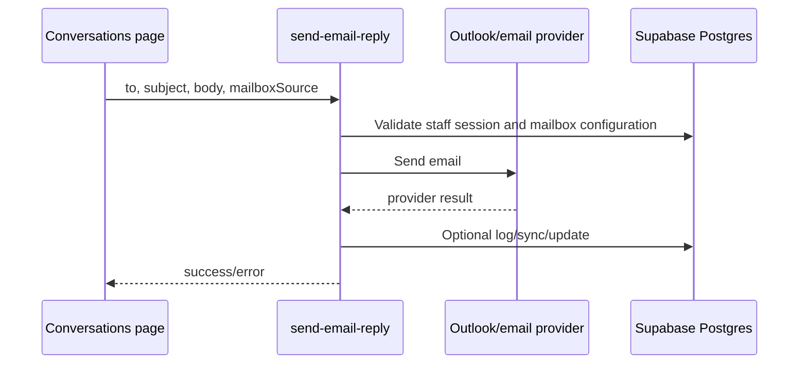

Email sending is separated from GHL message sending. The UI chooses `send-email-reply` for email and `send-ghl-message` for SMS/WhatsApp/GHL-backed channels.

## 16. Webhook communication flow

Several third-party systems call Supabase Edge Functions directly.

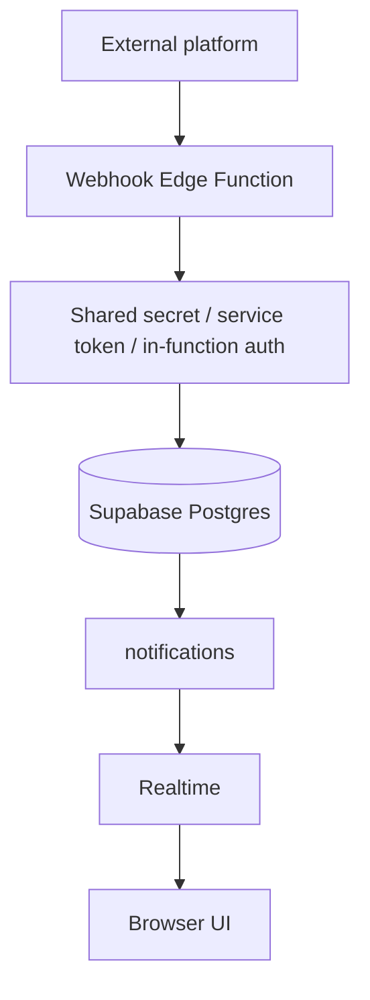

Examples:

| Webhook function | Caller / purpose |
| --- | --- |
| `ghl-webhook-receiver` | GHL contact/lead/event ingestion |
| `vapi-call-webhook` | Vapi call events and call log updates |
| `outlook-email-webhook` | Outlook mailbox sync/change notifications |
| `mission-control-webhook` | billing/payment/token-pack events |
| `auto-report-webhook` | external automation-triggered report generation |
| `pdf-parse-callback` / `pdf-parse-chunk-callback` | PDF parsing sidecar callbacks |

Webhook functions generally keep Supabase gateway JWT verification disabled and validate the caller inside the function using a service token, secret, or custom logic appropriate to that integration.

## 17. Template/PDF parsing and rendering communication flow

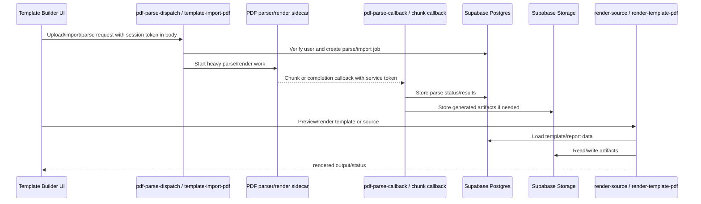

Important CORS/auth rule:

- template/PDF import and render functions often receive `session_token` in the request body instead of custom session headers to avoid broken CORS preflights on deployments where custom headers are not allowed.

## 18. Error and retry communication patterns

### 18.1 Browser-side network/auth errors

`invokeSecureFunction` returns normalized errors:

```ts
{ data: null, error: { message: string } }
```

Special cases:

- timeout -> `Request timed out. Please try again.`
- failed fetch/CORS -> diagnostic message naming the function
- 401/403/invalid session -> one-shot token refresh, then retry
- repeated auth failure -> auth circuit breaker trips and stale tokens may be cleared
- 402 insufficient funds -> global out-of-tokens event

### 18.2 Backend data-service failures

The report generator uses fallback wrappers and circuit breakers for data services. Non-critical service failures should be logged and recorded without collapsing the entire report where possible.

### 18.3 Background job failures

Failed background jobs should communicate through:

1. persisted job/report status;
2. `error_message` or equivalent error summary;
3. notification row when user-facing action is required;
4. UI cleanup in `BackgroundJobTracker`.

## 19. Debugging map

| Symptom | Start here | Likely issue |
| --- | --- | --- |
| User redirected to `/auth` | `useAuth.tsx`, `custom-auth-verify` | missing/expired staff `session_token`, stale auth version, failed verify |
| “Authentication required” from Edge Function | `secureInvoke.ts`, `_shared/auth.ts`, function `verify_jwt` config | missing body/header token, wrong auth surface, gateway JWT mismatch |
| CORS `Failed to fetch` on template import | `secureInvoke.ts` body-token list, `supabase/config.toml` function CORS/auth comments | custom header preflight blocked or stale deployment |
| Module page shows permission error | `usePermissions.tsx`, `ModuleGuard.tsx`, `user_permissions`, `dashboard_modules` | missing module permission or inactive module |
| Notifications not appearing | `NotificationsContext.tsx`, `notifications` table, realtime channel | row not inserted, target user mismatch, realtime subscription issue |
| Report job stuck | `BackgroundJobTracker.tsx`, `investment_reports.status`, report Edge Function logs | status not updated, background job not persisted, generation failure not marked |
| GHL conversations stale | `Conversations.tsx`, `sync-ghl-conversations`, GHL credentials | sync not triggered, bad credentials, contact missing `ghl_contact_id` |
| Outbound GHL message fails | `send-ghl-message`, `ghl_conversations`, GHL API response | missing conversation/contact ID, wrong channel payload, GHL credentials |
| Client portal kicks out | `usePortalAuth.tsx`, `client-portal-verify` | missing/expired `portal_session_token` |
| Finance portal kicks out | `useFinancePortalAuth.tsx`, `finance-portal-verify` | expired finance token, failed reverify, redirect guard triggered |
| Airtable listings fail | `airtable.ts`, `propertyDataService.ts`, `airtable-proxy` | Airtable secret/config issue, proxy error, table mismatch |

## 20. Communication extension rules

When adding a new communication path:

1. Decide which route surface owns it: internal, client portal, finance portal, or public.
2. Use the correct token system for that surface.
3. Use direct Supabase browser calls only for browser-safe data.
4. Use Edge Functions for secrets, third-party APIs, service-role reads/writes, webhooks, long jobs, and AI calls.
5. Reuse shared auth helpers for Edge Functions.
6. Add comments in `supabase/config.toml` when `verify_jwt=false` is required.
7. Persist long-running job state in Supabase.
8. Use realtime or polling to communicate status back to the UI.
9. Normalize external IDs into local tables, especially for GHL, Outlook, Vapi, and document pipelines.
10. Update this document whenever the request/response path crosses a new service boundary.

## 21. Quick mental model

```text
User action
  -> route surface auth/session layer
  -> component/page action
  -> direct Supabase call OR invoke helper
  -> Edge Function auth
  -> Supabase database/storage and/or external service
  -> persisted result/status/notification
  -> realtime event or polling refresh
  -> UI updates
```

This is the core communication loop of the NPC Command Centre.
