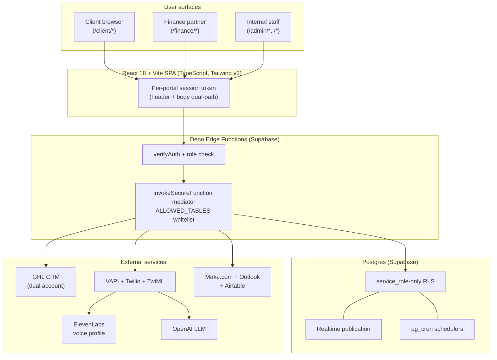
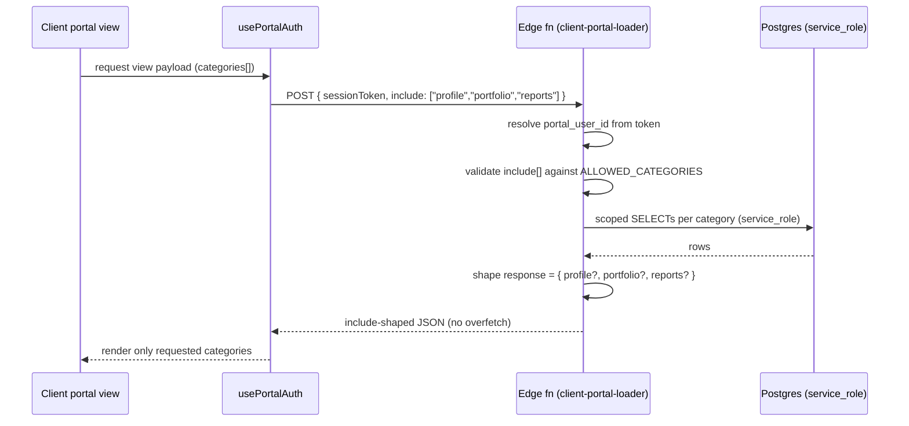
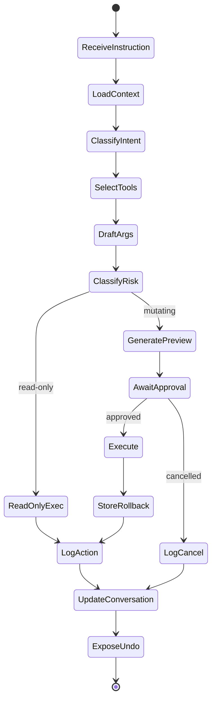
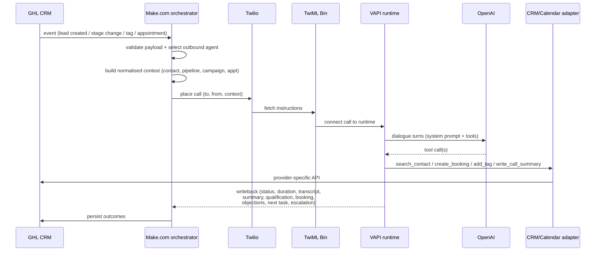
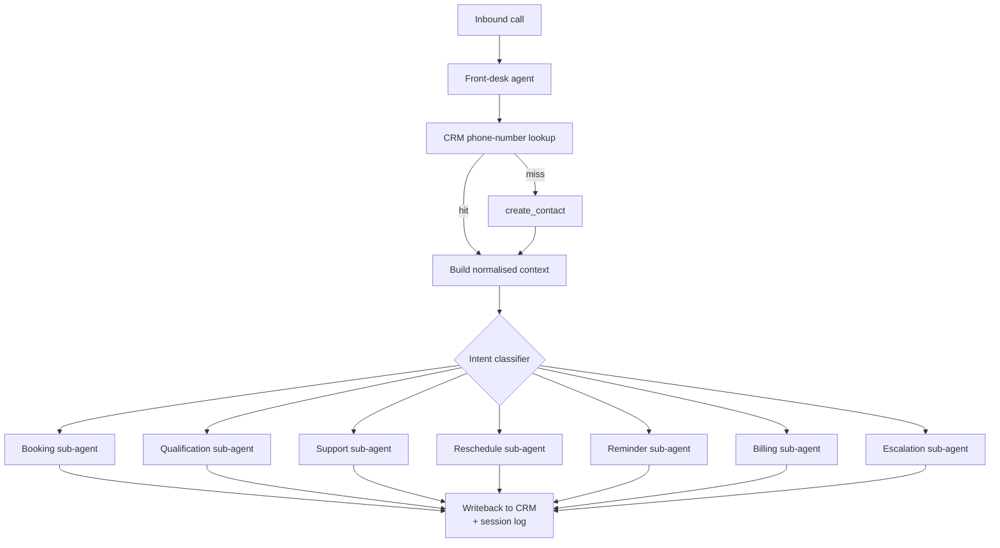
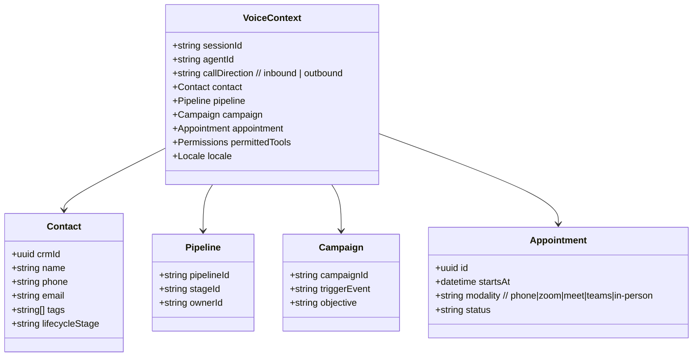
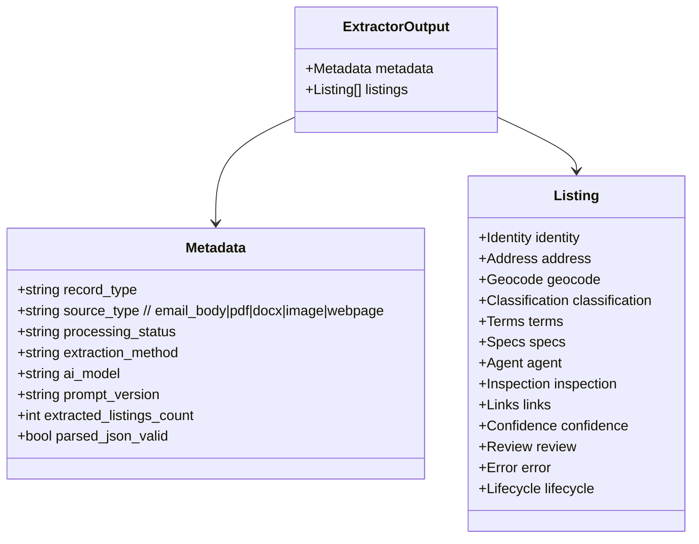
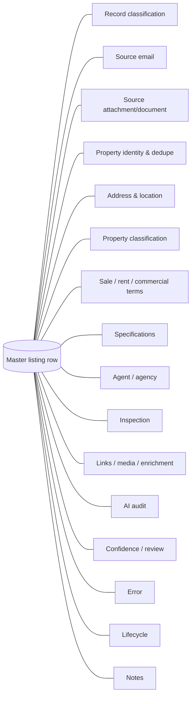
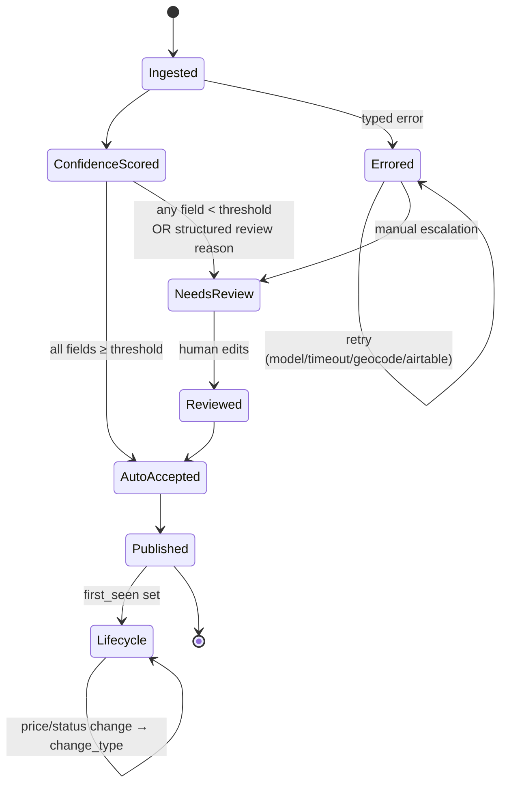

# Patent v2 — Flow Diagrams (Figs 1–16)

Companion to `AU_PATENT_SPECIFICATION_DRAFT_v2.md` §14. All diagrams are
Mermaid. Render via GitHub, VS Code Mermaid preview, or
`mmdc -i <file> -o <fig>.svg`. Each diagram below maps 1:1 to a numbered
figure in the specification.

---

## Fig 1 — System Topology



---

## Fig 2 — Client Portal Include-Mask Data Flow



---

## Fig 3 — Purchase File Aggregate + Hash-Chained Audit

```mermaid
flowchart LR
  PF[(purchase_files)]
  PF --> SH[purchase_file_status_history<br/>18-state machine]
  PF --> CD[critical_dates<br/>date_type]
  PF --> ST[settlement_tasks<br/>auto-seeded on unconditional_approval]
  PF --> DR[document_requirement_instances]
  PF --> LP[lender_packets + gap-check]
  PF --> DC[decisions<br/>subject_to_lmi_approval]
  PF --> CO[conditions]
  PF --> VA[valuations]
  PF -.bidirectional FK.-> CDEAL[(client_deals)]
  PF --> AF[activity_feed<br/>tri-portal visibility flags]

  subgraph Audit["purchase_file_audit_events (hash chain)"]
    A1[event N-1<br/>row_hash = H<sub>n-1</sub>]
    A2[event N<br/>prev_hash = H<sub>n-1</sub><br/>row_hash = SHA256(prev_hash‖payload)]
    A3[event N+1<br/>prev_hash = H<sub>n</sub>]
    A1 --> A2 --> A3
  end

  PF --> Audit
```

---

## Fig 4 — Calculator Prefill ↔ Push-Back

```mermaid
flowchart LR
  subgraph Records["Typed property records"]
    R1[(commercial_capex)]
    R2[(commercial_financing)]
    R3[(industrial_financing)]
  end

  subgraph Adapter["Normalisation adapter"]
    A1[prefill mapper]
    A2[push-back persister]
  end

  subgraph Engine["Calculator engine inputs/outputs"]
    E1[Borrowing / NOI / CapRate /<br/>ICR / DSCR / Debt Yield /<br/>GST / DCF / 10-yr CF]
  end

  Records -->|prefill| A1 --> E1
  E1 -->|selected outputs<br/>(NOI, assessment rate,<br/>funds-to-complete)| A2 --> Records

  Mode["sourceMode per tab:<br/>global · manualOverride ·<br/>aiPending · savedPropertyLinked · scenario"]
  Mode -.governs.-> A1
  Mode -.gates.-> A2
```

---

## Fig 5 — Borrowing Capacity Engine I/O

```mermaid
flowchart LR
  subgraph In[Inputs]
    I1[dealProfile<br/>assetCategory, state, leaseStatus]
    I2[purchaserStructure<br/>type, cash equity, liquidity]
    I3[propertyValuation<br/>price, market value, confidence]
    I4[leaseIncome<br/>passing/market rent, vacancy, recoveries]
    I5[operatingExpenses]
    I6[lendingAssumptions<br/>rate, buffer, floor, LVR, ICR, DSCR, Debt Yield]
    I7[acquisitionCosts<br/>stamp duty, fees, GST treatment]
  end

  ENG((Borrowing Capacity<br/>engine))

  subgraph Out[Outputs]
    O1[borrowingOutputs<br/>max loan, constraints]
    O2[fundsToComplete<br/>required equity]
    O3[ICR/DSCR/DebtYield<br/>compliance]
    O4[creditAssessmentStatus<br/>purchaseAbilityStatus]
    O5[warnings + required documents]
  end

  In --> ENG --> Out
```



---

## Fig 6 — Aurixa Agent Component Diagram

```mermaid
flowchart TB
  Chat[Chat surface<br/>command centre]
  Reg[Tool Registry<br/>~150 tools<br/>name · params · validation ·<br/>read-only/mutating · rollback flag]
  Classifier[Intent + risk classifier]
  Preview[Preview generator<br/>(mutating only)]
  Approval{User approval}
  Exec[Executor<br/>service-role calls]
  Log[Audit log<br/>+ rollback data store]
  Undo[Undo verifier<br/>ownership · state ·<br/>permission · target row]

  Chat --> Classifier --> Reg --> Preview --> Approval
  Approval -- approved --> Exec --> Log
  Approval -- cancelled --> Log
  Classifier -- read-only --> Exec
  Log --> Undo
  Undo -. rollback .-> Exec
```

---

## Fig 7 — Aurixa State Machine



---

## Fig 8 — Outbound Voice Flow



---

## Fig 9 — Inbound Front-Desk → Sub-Agent Routing



---

## Fig 10 — CRM Adapter Abstraction

```mermaid
flowchart LR
  subgraph Agents["Voice + Aurixa agents"]
    T1[search_contact]
    T2[create_contact]
    T3[create_booking]
    T4[add_tag]
    T5[write_call_summary]
  end

  STD[Standard tool surface<br/>(provider-agnostic schema)]
  T1 & T2 & T3 & T4 & T5 --> STD

  STD --> R[_shared/ghl-account.ts<br/>dual-account resolver]
  R -- legacy --> G1[GHL legacy account]
  R -- new --> G2[GHL new account]
  STD -. future .-> CRM2[Other CRM adapter]
```

---

## Fig 11 — Normalised Voice Context Object



---

## Fig 12 — Property Intake Pipeline

```mermaid
flowchart TB
  M[Outlook monitor<br/>(unread trigger)] --> S[Source intake<br/>master-table row]
  S --> H[HTML → text]
  H --> SEG[Segmenter<br/>~6k chars / 500 overlap]
  S --> AC[Attachment classifier]
  SEG --> R{Router}
  AC --> R
  R -- body/text --> TX[Text branch]
  R -- pdf/docx --> DOC[Document branch<br/>download → store → extract]
  R -- png/jpg --> IMG[Image branch<br/>visual extraction]
  R -- url --> LNK[Hyperlink classifier] --> WS[Webpage scraper]
  TX & DOC & IMG & WS --> EX[Schema-constrained<br/>LLM extractor]
  EX --> N[Normaliser<br/>state · postcode · sector · price]
  N --> GEO[Geocoder<br/>(Google Maps)]
  GEO --> DUP[Duplicate detector]
  DUP --> ING[(Airtable master table)]
  ING --> CR[Confidence + review]
  ING --> ERR[Error handler<br/>typed states]
  ING --> LC[Lifecycle tracker<br/>first/last seen, change_type]
```

---

## Fig 13 — LLM JSON Output Contract



---

## Fig 14 — Single Master Table Sections



---

## Fig 15 — Duplicate Detection Key Derivation

```mermaid
flowchart TB
  IN[Incoming normalised listing] --> K1[Key A: property_unique_id]
  IN --> K2[Key B: street_no + street + suburb + state + postcode]
  IN --> K3[Key C: project + estate + stage<br/>(land/H&L)]
  K1 & K2 & K3 --> M{Match against<br/>existing rows}
  M -- A hit --> S1[Confirmed Duplicate]
  M -- B hit, A miss --> S2[Possible Duplicate]
  M -- C hit, A+B miss --> S3[Possible Duplicate<br/>(project-level)]
  M -- B hit + diff price/status --> S4[Updated Existing]
  M -- no hit --> S5[New]
  M -- ambiguous --> S6[Needs Review]
  M -- excluded by rule --> S7[Not Duplicate]
  M -- unresolved --> S8[Unknown]
```

---

## Fig 16 — Confidence / Review / Error State Diagram



---

### Rendering tip

```bash
npx -y @mermaid-js/mermaid-cli \
  -i docs/patent/AU_PATENT_SPECIFICATION_DRAFT_v2_DIAGRAMS.md \
  -o docs/patent/figs/fig.svg
```
